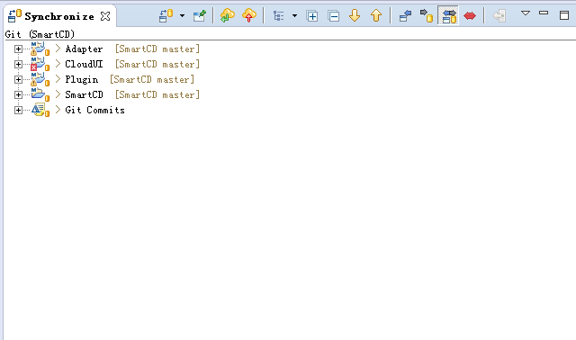

# git使用说明

## 1 git客户端

### 1.1 安装git客户端

下载地址：https://git-scm.com/downloads

### 1.2 git客户端使用说明

> 说明：在git的工作目录上右击（或者进入到git的工作目录，在空白处右击），选择`Git Bash Here`即可进入git工作窗口

### 1.3 git常用命令

> 说明：键入`git`即可查看git的命令，欲查看具体命令的说明只需键入`git help 具体命令`即可跳转至命令详情页

### 1.4 简单流程

1. 进入git的工作目录
2. 使用`git clone`命令来下载对应的工程
3. 使用`git checkout`命令来切换到对应的分支
4. 修改文件后使用`git add`命令来添加修改的文件
5. 使用`git commit`命令来提交添加的文件至本地仓库
6. 使用`git push`命令来推送本地代码至远程仓库（push前最好使用pull命令拉取最新代码，避免push失败）

## 2 eclipse使用git

### 2.1 导入git工程

> 说明：导入git工程时可以直接通过URI克隆，也可以先通过命令行的方式下载代码到本地后再从本地导入

### 2.2 同步工程

> 说明：在git工程上右击，选择Team->Synchronize Workspace即可跳转至Synchronize窗口，在该窗口可以进行各种常用的git操作，如commit、pull、push等